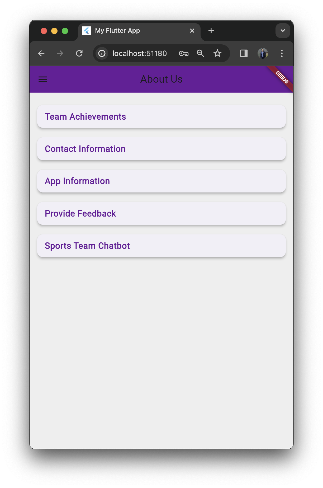

# SportsTeamManagementSystem
The SportsTeam Manager project is a Flutter-based app aimed at modernizing sports team management. Integrated with Firebase for real-time updates and Google Sign-In API for security, it goes beyond traditional management systems, fostering community engagement and event planning among college students.
# 🏀 SportsTeam Manager  

Flutter representation of a Sports Team Management app UI.

Star⭐ the repo if you like what you see 😉.

**Vishesh Sanghvi** 

## 📸 Screenshots

| About Us | Team |
|------|-------|
|||

| Events | Dashboard |
|------|-------|
|||

| Login1 | Welcome |
|------|-------|
|||

| OTP |
|------|
||

## ✨ Requirements
- Any Operating System (i.e., MacOS X, Linux, Windows)
- Any IDE with Flutter SDK installed (i.e., IntelliJ, Android Studio, VSCode, etc.)
- A little knowledge of Dart and Flutter
- A brain to think 🤓🤓

## 🤓 Author(s)
**Vishesh Sanghvi** 

## Getting Started

This project is a starting point for a Flutter application.

A few resources to get you started if this is your first Flutter project:

- [Lab: Write your first Flutter app](https://flutter.io/docs/get-started/codelab)
- [Cookbook: Useful Flutter samples](https://flutter.io/docs/cookbook)

For help getting started with Flutter, view our 
[online documentation](https://flutter.io/docs), which offers tutorials, 
samples, guidance on mobile development, and a full API reference. 
`
Feel free to use, modify, and distribute this project! If you have any questions or suggestions, feel free to reach out. Happy coding! 🚀

### Installation
1. Clone the repository:
git clone https://github.com/yourusername/SportsTeamManagementSystem.git

2. Navigate to the project directory:

3. Fetch dependencies using : flutter pub get

### Running the project
1. Ensure that an emulator/device is running or connected to your machine.
2. Run the project using Flutter

